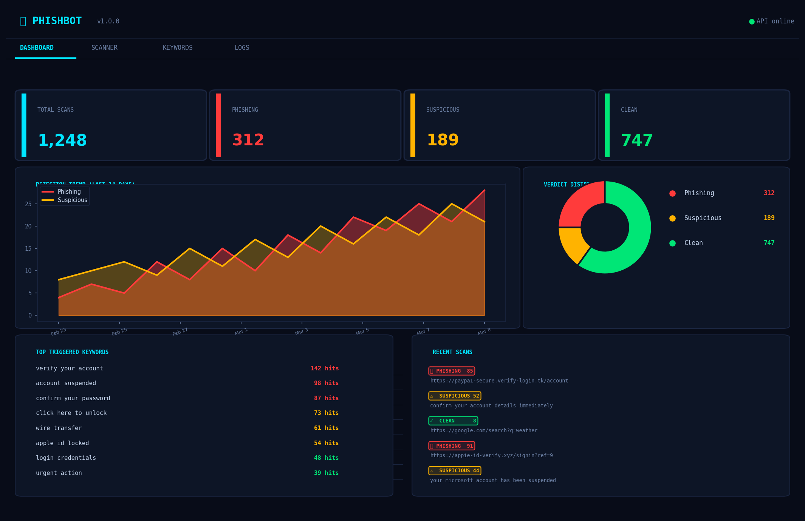
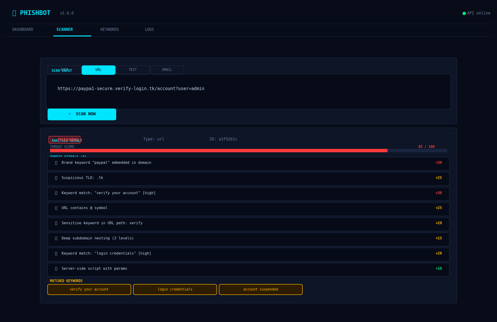
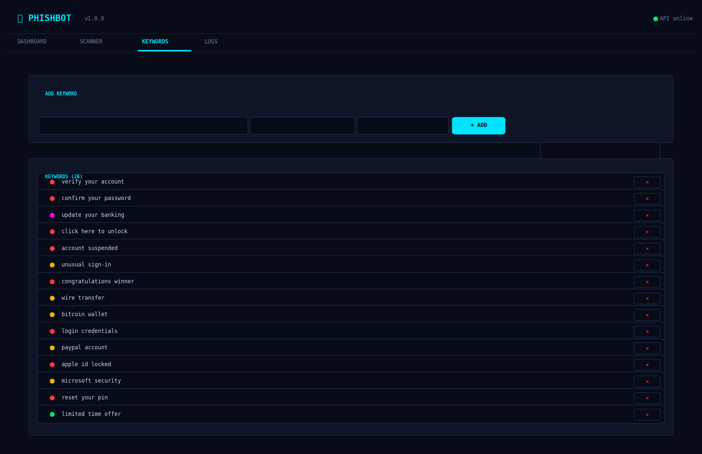
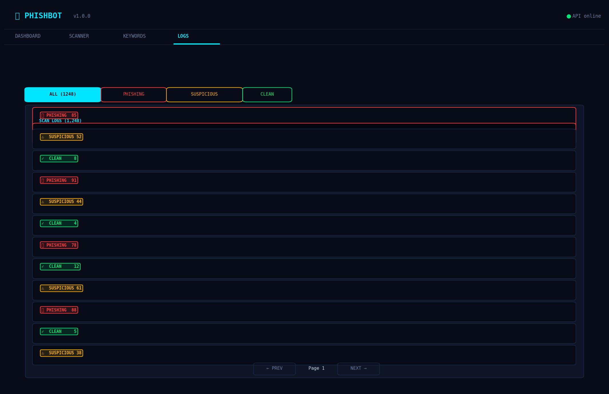
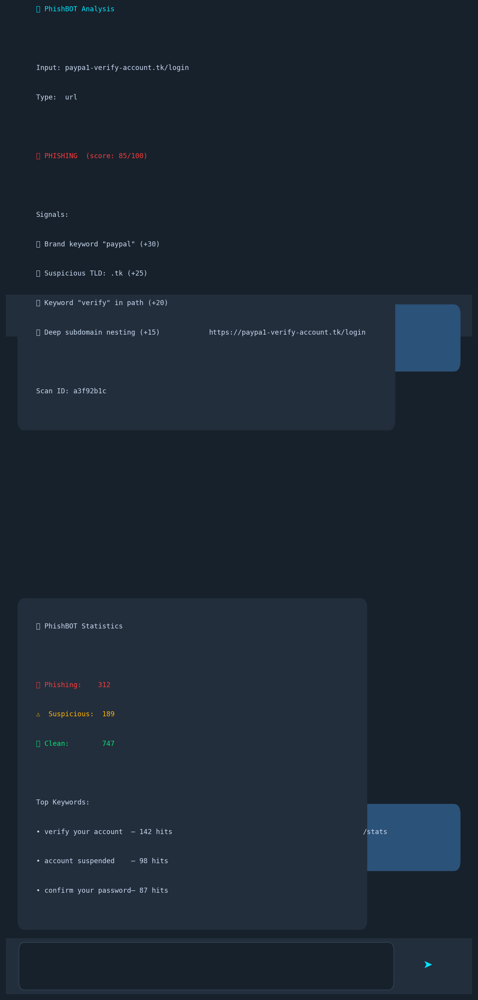

# 🎣 PhishBOT

> **Real-time phishing detection platform** — REST API engine, React dashboard, and Telegram bot. Built by [Ali AlEnezi](https://github.com/SiteQ8).

---

## 📸 Screenshots

### Dashboard — Live Detection Overview


### Scanner — Analyse URLs, Emails & Text


### Keywords — Threat Intelligence Management


### Logs — Full Scan History


### Telegram Bot — In-Chat Detection


---

## 🧠 How It Works

PhishBOT is built as three independent layers: a **detection engine**, a **REST API**, and two **client interfaces** (web dashboard + Telegram bot).

### Detection Engine (`backend/detector.js`)

Every scan passes through 5 sequential analysis layers, each contributing a numeric score. The final score determines the verdict.

```
Input (URL / Text / Email)
        │
        ▼
┌───────────────────────────┐
│  1. Allowlist Check        │  ← Trusted domains bypass all checks
├───────────────────────────┤
│  2. URL Structural         │  ← IP hosting, TLD, encoding, shorteners
│     Analysis               │    homograph attacks, subdomain depth
├───────────────────────────┤
│  3. Brand Impersonation    │  ← Levenshtein distance typosquat detection
│     (Typosquat Detection)  │    against 20+ major brands
├───────────────────────────┤
│  4. Text / Email Heuristics│  ← Urgency patterns, credential harvesting,
│                             │    generic salutations, embedded URLs
├───────────────────────────┤
│  5. Keyword DB Matching    │  ← User-managed keyword list with
│                             │    configurable severity weights
└───────────────────────────┘
        │
        ▼
   Score 0–100
        │
   ┌────┴─────────────────────────┐
   │  0–34   →  ✅ CLEAN          │
   │  35–69  →  ⚠  SUSPICIOUS     │
   │  70+    →  🚨 PHISHING       │
   └─────────────────────────────┘
```

#### Scoring Table

| Detection Layer         | Signal Example                          | Points  |
|-------------------------|-----------------------------------------|---------|
| Suspicious TLD          | `.tk`, `.xyz`, `.gq`, `.ml`             | +25     |
| Brand typosquat         | `paypa1.com`, `gooogle.tk`              | +30–35  |
| IP address host         | `http://192.168.1.1/login`              | +30     |
| URL contains `@`        | `http://user@evil.com`                  | +25     |
| URL-encoded hostname    | `http://evil%2Ecom`                     | +20     |
| Sensitive path keyword  | `/verify`, `/login`, `/secure`          | +20     |
| Deep subdomains (3+)    | `a.b.c.evil.tk`                         | +15     |
| URL shortener           | `bit.ly`, `tinyurl.com`                 | +15     |
| Cyrillic/IDN homoglyph  | `paypal.com` with Cyrillic chars        | +35     |
| Keyword (critical)      | `update your banking`                   | +45     |
| Keyword (high)          | `verify your account`                   | +30     |
| Keyword (medium)        | `wire transfer`                         | +20     |
| Keyword (low)           | `limited time offer`                    | +10     |
| Urgency language        | `urgent action required`                | +20     |
| Account suspension      | `your account has been suspended`       | +25     |
| SSN request             | `social security number`                | +35     |
| Credit card harvesting  | `credit card number`                    | +35     |

---

## 🖥️ Dashboard UI — Tab-by-Tab Guide

The React dashboard runs at `http://localhost:3000` and has 4 tabs.

### 1. Dashboard Tab

Real-time health check of your detection activity.

| Widget               | What it shows                                                |
|----------------------|--------------------------------------------------------------|
| **Stat boxes** (top) | Total scans, Phishing count, Suspicious count, Clean count   |
| **Area chart**       | Day-by-day phishing vs suspicious detections (last 14 days)  |
| **Pie chart**        | Verdict distribution as proportional breakdown               |
| **Top Keywords**     | The 10 keywords most frequently matched, by hit count        |
| **Recent Scans**     | Last 5 scan results with input preview and verdict badge     |
| **API Status dot**   | Green = backend reachable, Red = offline                     |

### 2. Scanner Tab

The interactive analysis tool. Supports three input modes:

| Mode    | Description                                              |
|---------|----------------------------------------------------------|
| `auto`  | Auto-detects URL vs text based on content                |
| `url`   | Forces URL structural analysis (best for single links)   |
| `text`  | Analyses raw text or email body content                  |
| `email` | Same as text, optimised for email body patterns          |

After scanning, the result panel shows:
- **Verdict badge** — colour-coded CLEAN / SUSPICIOUS / PHISHING
- **Threat Score bar** — visual 0–100 risk meter
- **Threat Signals** — each detection with its point contribution (🔴 high / 🟡 medium / 🟢 low)
- **Matched Keywords** — keywords from your database found in the input

### 3. Keywords Tab

Your threat intelligence library. Add, search, and delete keywords that the engine uses for matching.

**Categories:** `credential` · `urgency` · `financial` · `brand-abuse` · `scam` · `general`

**Severity levels** and their scoring impact:

| Severity   | Points Added |
|------------|-------------|
| `low`      | +10          |
| `medium`   | +20          |
| `high`     | +30          |
| `critical` | +45          |

The **Hits** counter tracks how many times each keyword triggered, letting you identify active threat patterns.

### 4. Logs Tab

Full audit trail of every scan. Filter by verdict, expand any row to see the full signal breakdown for that scan, and paginate through history.

---

## 🤖 Telegram Bot

Connects to your backend API and scans in real time inside any Telegram chat.

### Commands

| Command                             | Who         | Description                          |
|-------------------------------------|-------------|--------------------------------------|
| `/start`                            | Everyone    | Introduction and command list        |
| `/scan <url or text>`               | Everyone    | Manually scan an input               |
| `/stats`                            | Everyone    | Current detection statistics         |
| `/keywords`                         | Everyone    | List top 25 active keywords          |
| `/addkeyword <kw> [category] [sev]` | Admins only | Add a keyword to the database        |
| `/help`                             | Everyone    | Show help                            |

### Auto-Scan Mode

When `AUTO_SCAN=true` (default), the bot automatically scans every message:
- Messages containing a URL → URL structural analysis
- Messages longer than 30 characters → text heuristic analysis

For phishing/suspicious results, inline buttons appear:
- **📋 Full Report** — reference the scan ID in the web dashboard
- **✅ Mark Safe** — dismiss the alert

---

## 🏗️ Architecture

```
PhishBOT/
├── backend/
│   ├── server.js         Express entry point, middleware, rate limiting
│   ├── db.js             SQLite schema, seed keywords, seed allowlist
│   ├── detector.js       Core detection engine
│   └── routes/
│       ├── scan.js       POST /api/scan, POST /api/scan/bulk
│       ├── keywords.js   GET/POST/PATCH/DELETE /api/keywords
│       ├── logs.js       GET /api/logs, GET /api/logs/summary
│       └── allowlist.js  GET/POST/DELETE /api/allowlist
├── frontend/src/App.jsx  React dashboard (4 tabs)
├── bot/bot.py            Telegram bot (python-telegram-bot v21)
├── docs/screenshots/     UI screenshots
├── docker-compose.yml    Full-stack deployment
└── .env.example          Configuration template
```

---

## 🚀 Quick Start

### Backend API

```bash
cd backend && npm install && node server.js
# → http://localhost:3001
```

### React Dashboard

```bash
cd frontend && npm install && npm start
# → http://localhost:3000
```

### Telegram Bot

```bash
cp .env.example .env           # Edit: set TELEGRAM_TOKEN
cd bot && pip install -r requirements.txt
TELEGRAM_TOKEN=xxx API_BASE_URL=http://localhost:3001 python bot.py
```

### Docker (all-in-one)

```bash
cp .env.example .env
docker-compose up -d                        # API + Frontend
docker-compose --profile telegram up -d    # + Telegram bot
```

---

## 📡 API Reference

### Scan

```http
POST /api/scan
{ "input": "https://paypa1-secure.verify-login.tk", "type": "auto" }
```

```json
{
  "verdict": "phishing",
  "score": 85,
  "signals": [
    { "signal": "Brand keyword \"paypal\" embedded in domain", "score": 30 },
    { "signal": "Suspicious TLD: .tk", "score": 25 }
  ],
  "matchedKw": ["verify your account"]
}
```

### Keywords

```http
POST /api/keywords
{ "keyword": "verify your banking", "category": "financial", "severity": "critical" }
```

Bulk add:
```http
POST /api/keywords
{ "keywords": [{ "keyword": "reset your pin", "severity": "high" }] }
```

### All Endpoints

| Method   | Endpoint             | Description             |
|----------|----------------------|-------------------------|
| POST     | /api/scan            | Scan single input       |
| POST     | /api/scan/bulk       | Scan up to 50 inputs    |
| GET      | /api/keywords        | List keywords           |
| POST     | /api/keywords        | Add keyword(s)          |
| PATCH    | /api/keywords/:id    | Update severity/category|
| DELETE   | /api/keywords/:id    | Delete keyword          |
| GET      | /api/logs            | Paginated scan logs     |
| GET      | /api/logs/summary    | Dashboard stats         |
| POST     | /api/allowlist       | Add trusted domain      |
| GET      | /api/health          | Health check            |

---

## 🔒 Security Features

- Rate limiting — 200 req/15 min global, 60 req/min on scan endpoint
- Helmet.js — HTTP security headers (CSP, HSTS, X-Frame-Options)
- CORS control — configurable via `ALLOWED_ORIGIN`
- Input sanitization — stripped and length-capped before processing
- Allowlist bypass — trusted domains skip detection to reduce false positives

---

## 👤 Author

**Ali AlEnezi** — [@SiteQ8](https://github.com/SiteQ8)

Kuwait-based cybersecurity practitioner focused on security architecture, compliance frameworks, and offensive security tooling.

---

*PhishBOT is an open-source defensive security tool. Use responsibly.*
